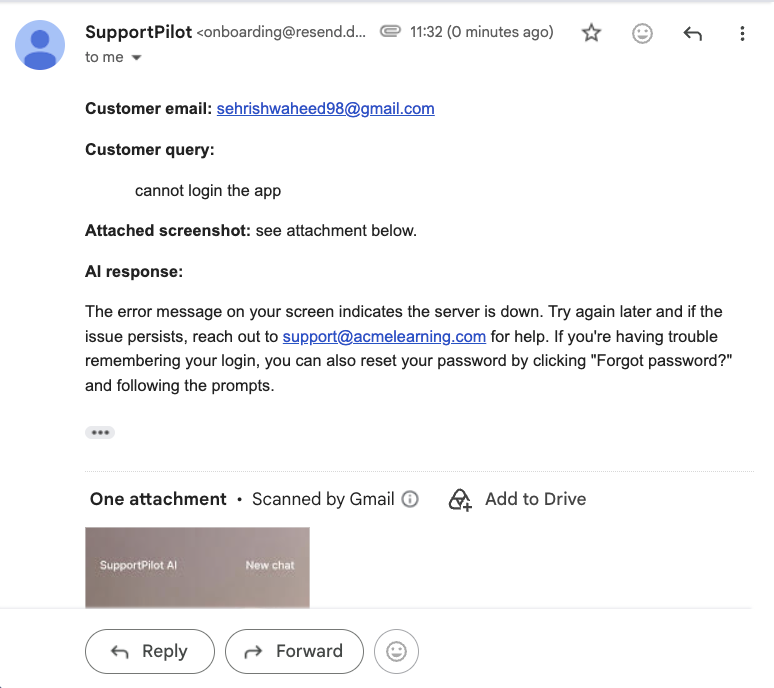
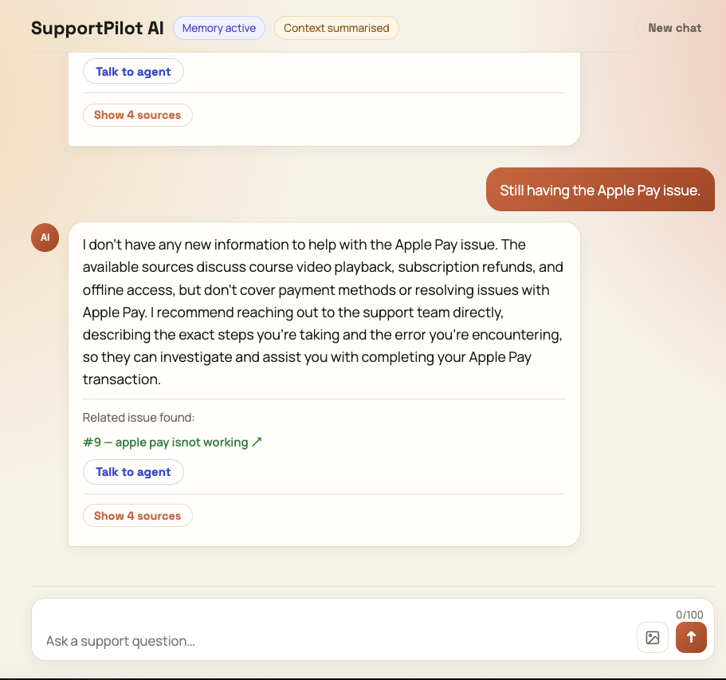
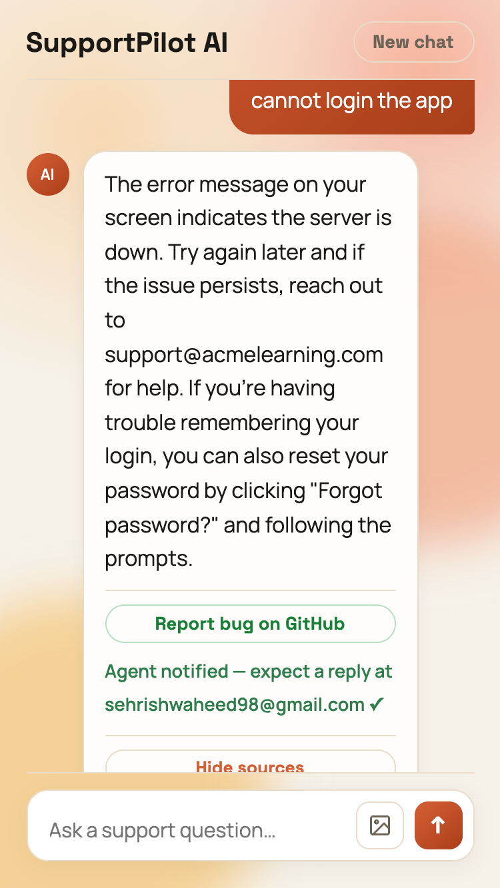
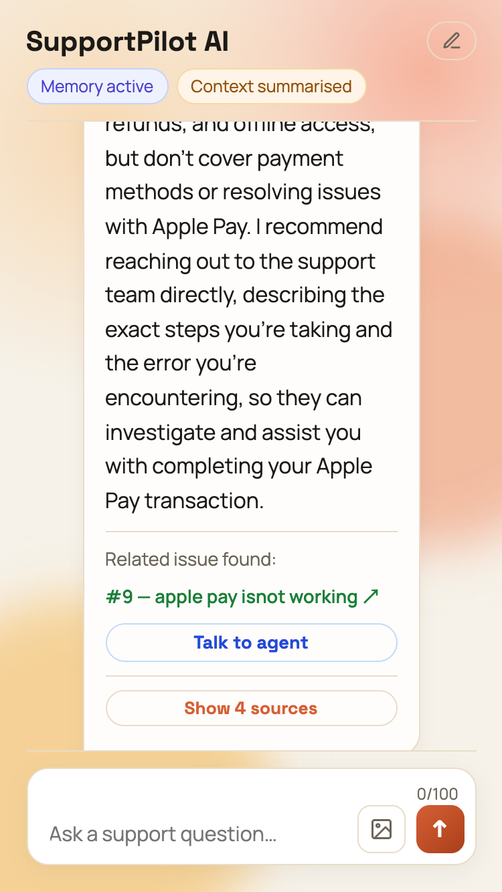

# SupportPilot AI

SupportPilot AI is a full-stack agentic customer support chatbot that combines knowledge-base retrieval, web search, GitHub issue tracking, vision AI, conversation memory with summarisation, and human agent escalation — all in one.

## Screenshots

### Desktop — Chat with GitHub issue surfaced


### GitHub issue found from user query


### Mobile — Active session


### Mobile — Context summarised after long session


---

## Features

- **Smart retrieval** — routes each query to knowledge base, web search, or GitHub issues based on intent
- **Vision support** — users can attach screenshots; the AI reads them using Llama 4 Scout
- **Conversation memory** — per-session history with automatic summarisation after 10 turns
- **GitHub integration** — surfaces related open issues and lets users file new bugs from the chat
- **Agent escalation** — emails a human agent with full context and any attached screenshot via Resend
- **Few-shot prompting** — model learns tone and format from curated examples, not just instructions
- **Streaming responses** — real-time streamed answers with animated thinking indicator
- **Mobile-friendly** — responsive UI with image attachment support

## Stack

- **Node.js + TypeScript** (ESM)
- **Groq** — `llama-3.3-70b-versatile` for text, `llama-4-scout-17b-16e-instruct` for vision (both free tier)
- **Google Gemini** — `gemini-embedding-001` for embeddings
- **Supabase + pgvector** — vector storage and similarity search
- **GitHub MCP** (`@modelcontextprotocol/server-github`) — issue search and creation
- **Resend** — transactional email for agent escalation
- **Express** — API server
- **React + Vite** — frontend

## Project Structure

```
├── server.ts                     # Express API server
├── webSearchRetrievalAgent.ts    # Main agent orchestration
├── tools/knowledgeBaseTool.ts    # Vector retrieval tool
├── prompts.ts                    # System prompt
├── constants.ts                  # Model and KB configuration
├── config.ts                     # Groq + Google + Supabase clients
├── rateLimiter.ts                # Request rate limiter
├── scripts/
│   ├── seed.ts                   # Embed and insert knowledge base documents
│   ├── reembed.ts                # Re-embed existing documents
│   └── check.ts                  # Verify seeded documents
└── frontend/                     # React + Vite UI
```

## Setup

### 1. Install dependencies

```bash
npm install
```

### 2. Configure environment variables

```bash
cp .env.example .env
```

Fill in your values:

```env
GROQ_API_KEY=             # from console.groq.com (free tier available)
GOOGLE_GENERATIVE_AI_API_KEY=   # from aistudio.google.com (used for embeddings only)
SUPABASE_URL=             # from your Supabase project settings
SUPABASE_SERVICE_ROLE_KEY=      # from your Supabase project settings
```

### 3. Set up Supabase

#### Enable pgvector

In your Supabase project, go to **SQL Editor** and run:

```sql
CREATE EXTENSION IF NOT EXISTS vector;
```

#### Create the documents table

```sql
CREATE TABLE documents (
  id bigserial PRIMARY KEY,
  content text NOT NULL,
  metadata jsonb,
  embedding vector(1536)
);
```

#### Create the match_documents function

> **Required:** The knowledge base search will not work without this function. Run it once in the Supabase SQL Editor before starting the app.

```sql
CREATE OR REPLACE FUNCTION match_documents(
  query_embedding vector(1536),
  match_count int
)
RETURNS TABLE (
  id bigint,
  content text,
  metadata jsonb,
  similarity float
)
LANGUAGE sql STABLE
AS $$
  SELECT
    id,
    content,
    metadata,
    1 - (embedding <=> query_embedding) AS similarity
  FROM documents
  ORDER BY embedding <=> query_embedding
  LIMIT match_count;
$$;
```

### 4. Seed the knowledge base

Embeds and inserts sample support documents into Supabase. Re-running this clears and re-seeds from scratch.

```bash
npx tsx scripts/seed.ts
```

To verify documents were inserted:

```bash
npx tsx scripts/check.ts
```

### 5. Start the app

```bash
npm run dev
```

Open the frontend at **http://localhost:3000**

## API

### `POST /api/search`

```json
{ "query": "How do I reset my password?" }
```

Response:

```json
{
  "answer": "...",
  "sources": [],
  "toolUsed": "knowledgeBaseSearch"
}
```

### `POST /api/search/stream`

Same request body — streams the response as newline-delimited JSON events.

### `GET /api/health`

```json
{ "ok": true, "service": "supportpilot-api" }
```

## Customizing For Your Own Brand

1. Update `KNOWLEDGE_BASE_DESCRIPTION` in `constants.ts` with your product name.
2. Edit the documents array in `scripts/seed.ts` with your own support content.
3. Tune the system prompt in `prompts.ts` for your tone and policy.
4. Re-run `npx tsx scripts/seed.ts` to apply changes.

## Example Questions

- "How do I reset my password?"
- "What are your pricing plans?"
- "Can I get a refund?"
- "How do I download courses for offline access?"
- "Does the platform integrate with Slack?"
